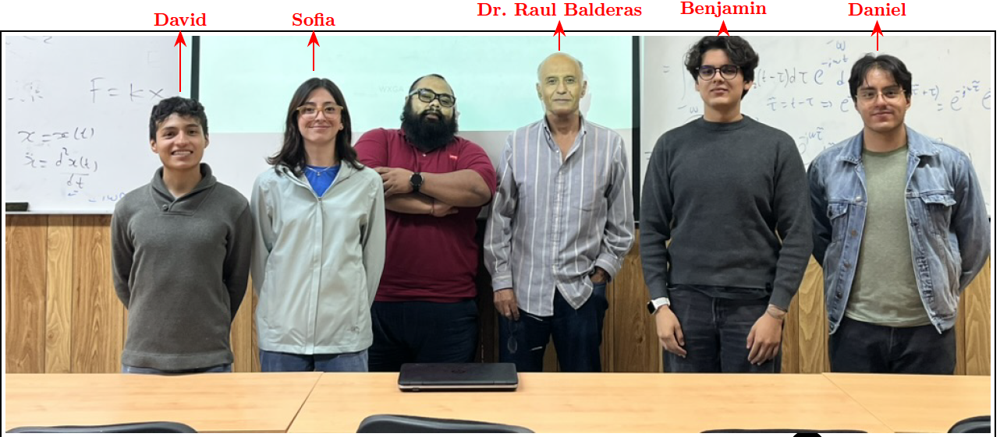

      

<h1>NANOPHOTONICS AND OPTOELECTRONICS MATERIALS RESEARCH GROUP</h1>

This research group is led by 
<a href="https://www.iico.uaslp.mx/Paginas/Cuerpos-Academicos/2663#gsc.tab=0">Dr. Raúl E. Balderas-Navarro</a>, 
with postdoctoral researcher <a href="https://ruco13.github.io">Dr. Oscar Ruiz Cigarrillo</a> serving as repository administrator and research collaborator.

The group focuses on studying the optical properties of nanostructured semiconductor materials, both experimentally and theoretically, using techniques such as Reflectance Anisotropy Spectroscopy (RAS), Photoreflectance (PR), Ellipsometry (SE), Photoluminescence (PL), Magneto-Optic Kerr Effect (MOKE), and many-body ab initio simulations.

We also aim to develop open-source software tools for high-quality analysis of experimental results and support the advancement of electronic band structure calculations.

<strong>Current undergraduate student members:</strong>

<ul>
  <li>Ana Sofía Solorio Orozco</li>
  <li>Daniel Alejandro Martínez Lara</li>
  <li>David Alejandro Zarazúa Martínez</li>
  <li>Benjamín Adonay Culebro García</li>
  <li>Óscar Iván Muñoz Pimentel</li>
  <li>Brandon Aguilera</li>
</ul>

All of them are actively contributing to research and development within the group.

<!-- Group Photo -->

<strong>Group Photo:</strong>

<!-- <h2>Tools and Technologies</h2>
<table>
<tr>
<td>OS</td>
<td> 
 
 
</td>
<tr>
<tr>
<td>Programming</td>
<td> 
 
 
 
 
 
 
</td>
</tr>
<tr>
<td>ML/DL</td>
<td> 
 
 

</td>
</tr>
<tr>
<td>Frameworks</td>
<td> 
</td>
</tr>
<tr>
<td>IDE/Editors</td>
<td> 
 
</td>
</tr>
<tr>
<td>Version Control</td>
<td>

 </td>
</tr>
</table> -->

<h2>Acknowledgments</h2>

We gratefully acknowledge the support provided by:

  

    
    
<strong>Secretaría de Ciencia, Humanidades, Tecnología e Innovación</strong>

  

  
  

    
    
<strong>Laboratorio Nacional de Supercómputo del Sureste de México</strong>

  

